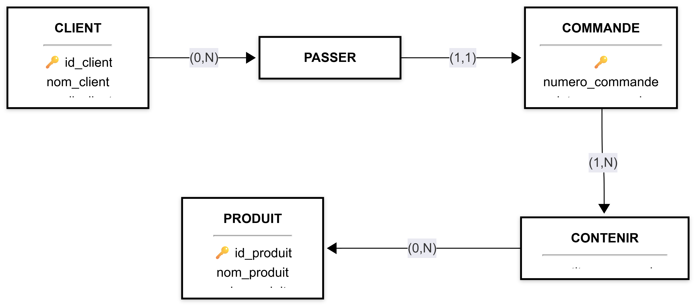

# Partie pratique — Gestion des commandes

## 1. Reprendre les entités

Pour le système de gestion des commandes, nous avons identifié trois entités :

### CLIENT

* **id_client** : identifiant
* nom_client
* email_client

### COMMANDE

* **numero_commande** : identifiant
* date_commande

### PRODUIT

* **id_produit** : identifiant
* nom_produit
* prix_produit

---

## 2. Les règles de gestion

Les règles de gestion sont :

> Un client peut passer plusieurs commandes.

> Une commande est passée par un seul client.

> Une commande contient plusieurs produits.

> Un produit peut être présent dans plusieurs commandes.

---

## 3. Identifier les associations

### Association entre CLIENT et COMMANDE

Les règles indiquent une relation entre :

```text
CLIENT ↔ COMMANDE
```

Nous nommons cette association :

```text
PASSER
```

Donc :

```text
CLIENT ─── PASSER ─── COMMANDE
```

### Association entre COMMANDE et PRODUIT

Les règles indiquent une relation entre :

```text
COMMANDE ↔ PRODUIT
```

Nous nommons cette association :

```text
CONTENIR
```

Donc :

```text
COMMANDE ─── CONTENIR ─── PRODUIT
```

---

## 4. Déterminer les cardinalités

### Association PASSER

Règle :

> Un client peut passer plusieurs commandes.

Un client peut ne passer aucune commande ou plusieurs commandes.

```text
CLIENT → (0,N)
```

Règle :

> Une commande est passée par un seul client.

Une commande doit être liée à un seul client.

```text
COMMANDE → (1,1)
```

Donc :

```text
CLIENT ─── (0,N) ─── PASSER ─── (1,1) ─── COMMANDE
```

---

## 5. Association CONTENIR

Règle :

> Une commande contient plusieurs produits.

Une commande contient au minimum un produit et peut en contenir plusieurs.

```text
COMMANDE → (1,N)
```

Règle :

> Un produit peut être présent dans plusieurs commandes.

Un produit peut ne pas encore être présent dans une commande ou être présent dans plusieurs commandes.

```text
PRODUIT → (0,N)
```

Donc :

```text
COMMANDE ─── (1,N) ─── CONTENIR ─── (0,N) ─── PRODUIT
```

Cette relation est une relation :

```text
N : N
```

---

## 6. Placer `quantite_commandee`

La donnée :

```text
quantite_commandee
```

représente la quantité d'un produit dans une commande.

Elle ne dépend pas uniquement du produit.

Exemple :

```text
C001 + Clavier → 2
C002 + Clavier → 5
```

Le même produit peut donc avoir une quantité différente selon la commande.

Ainsi, `quantite_commandee` appartient à l'association :

```text
CONTENIR
```

Représentation :

```text
COMMANDE ─── CONTENIR ─── PRODUIT
                  │
                  └── quantite_commandee
```

---

## 7. MCD complet



---
## 8. Vérification des règles

| Règle de gestion                                       | Cardinalité      |
| ------------------------------------------------------ | ---------------- |
| Un client peut passer plusieurs commandes.             | CLIENT `(0,N)`   |
| Une commande est passée par un seul client.            | COMMANDE `(1,1)` |
| Une commande contient plusieurs produits.              | COMMANDE `(1,N)` |
| Un produit peut être présent dans plusieurs commandes. | PRODUIT `(0,N)`  |

Toutes les cardinalités sont cohérentes avec les règles de gestion.


