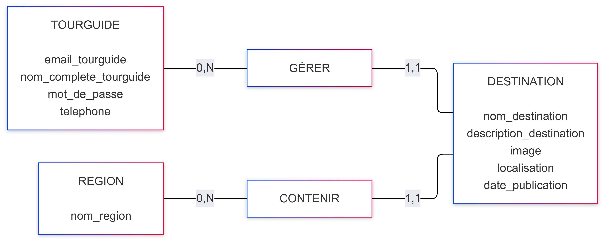

---

marp: true
theme: default
paginate: true
--------------

# Modèle Conceptuel de Données


---

# 1. Les entités

Le système contient trois entités :

```text
TOURGUIDE

REGION

DESTINATION
```

---

# 2. Relation TOURGUIDE — DESTINATION

Un **TourGuide** peut gérer plusieurs destinations.

Une **Destination** est gérée par un seul TourGuide.

### Cardinalités

```text
TOURGUIDE (0,N) ─── GÉRER ─── (1,1) DESTINATION
```

---

# 3. Relation REGION — DESTINATION

Une **Région** peut contenir plusieurs destinations.

Une **Destination** appartient à une seule Région.

### Cardinalités

```text
REGION (0,N) ─── CONTENIR ─── (1,1) DESTINATION
```

---

# 4. MCD final




